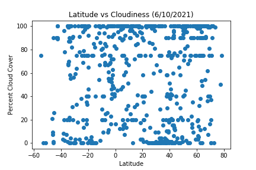
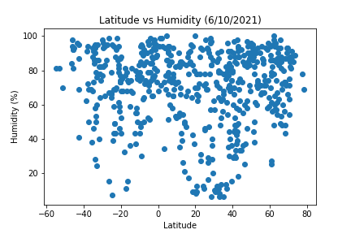

<!DOCTYPE html>
<html lang="en">

<head>
  <meta charset="UTF-8">
  <title>Latitude Study</title>
  <link rel="stylesheet" href="https://stackpath.bootstrapcdn.com/bootstrap/4.3.1/css/bootstrap.min.css" integrity="sha384-ggOyR0iXCbMQv3Xipma34MD+dH/1fQ784/j6cY/iJTQUOhcWr7x9JvoRxT2MZw1T" crossorigin="anonymous">
  <link rel="stylesheet" href="style.css">
</head>
<body>
  <nav class="navbar navbar-expand-lg navbar-light bg-light">
    <a class="navbar-brand" href="index.html">Latitude</a>
    <button class="navbar-toggler" type="button" data-toggle="collapse" data-target="#navbarSupportedContent" aria-controls="navbarSupportedContent" aria-expanded="false" aria-label="Toggle navigation">
      
    </button>

    

      <ul class="navbar-nav mr-auto">
        <li class="nav-item dropdown">
          <a class="nav-link dropdown-toggle" href="#" id="navbarDropdown" role="button" data-toggle="dropdown" aria-haspopup="true" aria-expanded="false">Plots</a>
            

              <a class="dropdown-item" href="CloudCover.html">Cloud Cover</a>
              <a class="dropdown-item" href="Humidity.html">Humidity</a>
              <a class="dropdown-item" href="Temperature.html">Temperature</a>
              <a class="dropdown-item" href="WindSpeed.html">Wind Speed</a>
            
        
        </li>
        <li class="nav-item">
          <a class="nav-link" href="Comparison.html">Comparison</a>
        </li>
        <li class="nav-item">
          <a class="nav-link" href="Data.html">Data</a>
        </li>
      </ul>
    

  </nav>

  

    

      <h1 class = "jumbotron">Summary: Impact of Latitude on Various Factors</h1>
      

      
This is placed inside a container

    

  

  <h3 class="text-center">Visualizations</h3>
    

        

          

            
          

          

              <h5>Latitude vs Cloud Cover</h5>
          

        
  
        

            

              
            

            

                <h5>Latitude vs Humidty</h5>
            

        
    
        

          

            
          

          

              <h5>Latitude vs Maximum Temperature</h5>
          

        
      
        

          

            
          

          

              <h5>Latitude vs Wind Speed</h5>
          

        

    

</body>
